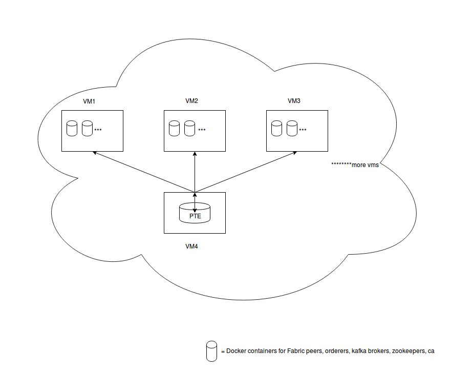

# Ansible Test Driver (ATD) for Hyperledger Fabric-test

Ansible Test Driver is an ansible driven automated tool which can drive tools like PTE and OTE,
which can be found in the fabric-test repository, to test several components on a deployed Hyperledger Fabric network.

## ATD can do the following to drive PTE:

Driving PTE using ATD reduces the effort of modifying the channel configuration files, samplecc-chan-create-TLS.json files,
and running the create, join, install, instantiate, invokes and queries separately by doing the following:

 - Auto-generates channel configuration files that are necessary to run PTE by parsing vars/<filename>.yml
 - Auto-generates samplecc-chan-create-TLS.json files that are required to create the channels by parsing vars/<filename>.yml
 - Generates channel configuration transactions using configtxgen and mounts them to PTE docker container
 - Builds docker image for PTE and launches PTE in a separate container
 - Drives PTE tests from inside the container
 - Create channels, join peers to channels, install chaincodes on the peers, instantiate the chaincodes, and send
   invokes and queries from PTE container

 

## Prerequisites

- [Ubuntu 16.04 machines] (https://cloud-images.ubuntu.com/releases/16.04/)
- [Install Ansible 2.3.0.0 or above](http://docs.ansible.com/ansible/intro_installation.html)
  ```
  sudo apt-get update
  sudo apt-get install python-dev python-pip libssl-dev libffi-dev -y
  sudo pip install --upgrade pip
  sudo pip install six==1.10.0
  sudo pip install ansible==2.3.0.0
  ```
### Cloning fabric-test repository
 - Clone the [fabric-test repository](https://gerrit.hyperledger.org/r/fabric-test) onto the ansible controller
```
  cd .../path/to/fabric-test
```
 - Refer [fabric-test/README.md](https://github.com/hyperledger/fabric-test/blob/master/README.md) to initialize the git submodules or update the submodules if you have already initialized the git submodules

### Hyperledger Fabric Network
```
  cd .../path/to/fabric-test/cello/src/agent/ansible                 # and launch the network; then:
```
 - (Refer [Cello - Hyperledger Fabric Deployment to provision the machines and launch the network](https://github.com/hyperledger/cello/tree/master/src/agent/ansible)) for launching the Hyperledger Fabric Network.
 - To use a single machine as ansible controller and for launching network on it, refer [All-in-one.md](https://github.com/hyperledger/cello/blob/master/src/agent/ansible/vars/All-in-one.md)

## Using ATD to drive PTE

### Setting up the channels
Edit `.../path/to/fabric-test/tools/ATD/vars/<filename>.yml` with your list of channel names, organizations that are part of that channel, and the orderer to which the requests have to be routed based on hyperledger fabric network configuration.

For example, `vars/2channels.yml` looks like this
```
pte: {

  # The user to connect to the server
  ssh_user: "ubuntu",
  ptechannels: [
    {name: "testorgschannel1", orgs: ["orga", "orgb"], orderer: "orderer0"},
    {name: "testorgschannel2", orgs: ["orga", "orgb"], orderer: "orderer0"}
  ]
}
```

### Launching PTE
Now, run the following command to launch the PTE in a container
```
  cd .../path/to/fabric-test/tools/ATD/
  ansible-playbook -i ../../cello/src/agent/ansible/run/runhosts \
  --extra-vars "chaincode=samplecc testcase=FAB-3983-i-TLS" -e "mode=apply env=bc1st tool_type=pte pteenv=2channels" ptesetup.yml
```

Behind the scenes, it will use templates under `roles/tool_pte/ptesetup/templates/` to generate the chan-config-TLS.json,
samplecc-chan-create-TLS.json, pte-compose.json files depending vars/2channels.yml

In the above command,
 - `-i <filename>` is used to provide an input file like host file which is needed by ansible to run against
    - `-i ../../cello/src/ansible/run/runhosts` refers the runhosts file generated while provisioning the machines using cello/src/agent/ansible
 - `--extra-vars "var=<value>"` is used to pass in a variable to the playbook
    - `testcase=<Testcase Number>` is used to run a specific testcase that is defined in the PTE/CITest directory. Refer the list of available testcases in PTE/CITest/scripts/test_driver.sh.
    - `chaincode=<chaincode name>` is used to specify which chaincode to use. It can be chaincode=samplecc | all | marbles.
 - `env=<value>`to pass the environment variable file
    - Make sure that the `env` value is same as `env` value that is used in launching the Hyperledger Fabric network section.
    - For example, if the network is launched by using the following command
      `ansible-playbook -i run/runhosts -e "mode=apply *env*=bc1st deploy_type=compose" setupfabric.yml`, then `bc1st` is the environment variable file
 - `mode=<apply|destroy>` refers to set the mode for PTE in a container.
    - `mode=apply` launch the PTE container,
    - `mode=destroy` remove the PTE container and PTE image and network artifacts of the test environment
 - `tool_type=<type of tool>` type of tool to drive
    - `tool_type=pte` to run the PTE
 - `pteenv=<file name>` pte environment file to be used
    - `pteenv=2channels` to use two channels with PTE
