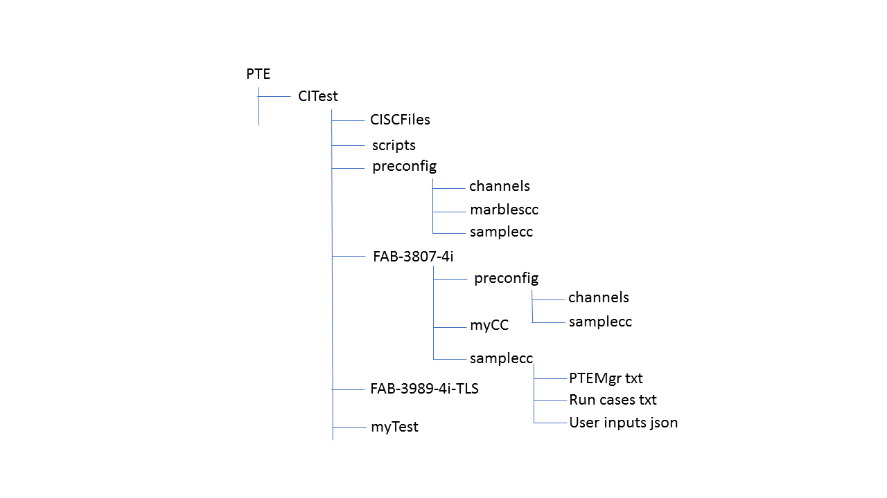

# PTE Automation CI Test

---
# Introduction

The purpose of this CI test is to automatically execute the predefined tests daily or weekly that any unexpected or undesired code changes may be uncovered as soon as possible and to flexibly incorporate an user supplied chaincode test.  The CI test uses [PTE](https://github.com/hyperledger/fabric-test/tree/release-1.3/tools/PTE) to driver transactions.  The functions of the CI tool include the following:

- setup PTE environment, see [PTE](https://github.com/hyperledger/fabric-test/tree/release-1.3/tools/PTE) for detail

- create Blockchain network using [Network Launcher](https://github.com/hyperledger/fabric-test/tree/release-1.3/tools/NL)

- configure Blockchain network including create/join channels and install/instantiate chaincodes

- execute test cases

---
# Usage

The command is located in `PTE/CITest/scripts`

* ### command

        ./test_driver.sh [opt] [values]
                -e: install sdk packages, default=no
                -n: create network, default=no
                -m: directory containing test_nl.sh to be used to create network and PTE config input files to be used to configure channels and to install and instantiate chaincode, default=scripts
                -p: preconfigure creation/join channels, default=no
                -s: synchup peer ledgers, recommended when network brought up, default=no
                -c: chaincode to be installed and instantiated [all|<chaincode>], default=no
                -u: chaincode to be installed and upgraded [all|<chaincode>], default=no
                -t [value1 value2 value3 ...]: test cases to be executed

* ### available test cases

        FAB-query-TLS: 4 processes X 1000 queries, TLS
        FAB-3983-i-TLS: FAB-3983, longrun: 4 processes X 60 hours invokes, constant mode, 1k payload, TLS
        FAB-4162-i-TLS: FAB-4162, longrun: 4 processes X 60 hours mix mode, vary 1k-2k payload, TLS
        FAB-4229-i-TLS: FAB-4229, longrun: 8 processes X 36 hours mix mode, vary 1k-2k payload, TLS
        FAB-3989-4i-TLS: FAB-3989, stress: 4 processes X 1000 invokes, constant mode, 1k payload, TLS
        FAB-3989-4q-TLS: FAB-3989, stress: 4 processes X 1000 queries, constant mode, 1k payload, TLS
        FAB-3989-8i-TLS: FAB-3989, stress: 8 processes X 1000 invokes, constant mode, 1k payload, TLS
        FAB-3989-8q-TLS: FAB-3989, stress: 8 processes X 1000 queries, constant mode, 1k payload, TLS
        marbles-i-TLS: marbles chaincode, 4 processes X 1000 invokes, constant mode, TLS
        marbles-q-TLS: marbles chaincode, 4 processes X 1000 queries, constant mode, TLS
        robust-i-TLS: robustness: 4 processes X invokes, constant mode, 1k payload, TLS
        FAB-3833-2i: 2 processes X 10000 invokes, TLS, couchDB
        FAB-3810-2q: 2 processes X 10000 queries, TLS, couchDB
        FAB-3813-8i-CouchDB-4ch: 8 processes X 10000 invokes, TLS, couchDB, 4 channels
        FAB-3814-2i-CouchDB-LargePayload: 2 processes X 10000 invokes, TLS, couchDB, 1m payload
        FAB-3816-2i-CouchDB-10peersPerOrg: 2 processes X 10000 invokes, TLS, couchDB, 10 peers/org
        FAB-4044-2i-CouchDB-10orderers: 2 processes X 10000 invokes, TLS, couchDB, 10 orderers
        FAB-4043-8i-CouchDB-4cc: 8 processes X 10000 invokes, TLS, couchDB, 4 chaincodes
        FAB-4045-2i-CouchDB-8kafkas: 2 processes X 10000 invokes, TLS, couchDB, 8 kafkas
        FAB-3832-4i: 4 processes X 10000 invokes, TLS, couchDB
        FAB-3834-4q: 4 processes X 10000 queries, TLS, couchDB
        FAB-3808-2i: 2 processes X 10000 invokes, TLS
        FAB-3811-2q: 2 processes X 10000 queries, TLS
        FAB-3807-4i: 4 processes X 10000 invokes, TLS
        FAB-3835-4q: 4 processes X 10000 queries, TLS
        FAB-4036-2q: samplecc Node JS chaincode, 2 processes X 10000 queries, TLS, levelDB
        FAB-4038-2i: samplecc Node JS chaincode, 2 processes X 10000 invokes, TLS, levelDB
        FAB-7204-4i: samplecc Node JS chaincode, 4 processes X 12 hours invokes, constant mode, TLS, levelDB
        FAB-7204-4q: samplecc Node JS chaincode, 4 processes X 100 invokes, TLS, levelDB
        FAB-7331-4i: samplecc Node JS chaincode, 4 processes X 10000 invokes, TLS, levelDB, 1 channel, event listener: per transaction
        FAB-7332-4i: samplecc Node JS chaincode, 4 processes X 10000 invokes, TLS, levelDB, 2 channel, event listener: per transaction
        FAB-7329-4i: samplecc Node JS chaincode, 4 processes X 10000 invokes, TLS, levelDB, 1 channel, channel event service, event listener: per transaction
        FAB-7246-4i: samplecc Node JS chaincode, 4 processes X 10000 invokes, TLS, levelDB, 2 channel, channel event service, event listener: per transaction
        FAB-7333-4i: samplecc Node JS chaincode, 4 processes X 10000 invokes, TLS, levelDB, 1 channel, filtered block event service, event listener: per transaction
        FAB-7334-4i: samplecc Node JS chaincode, 4 processes X 10000 invokes, TLS, levelDB, 2 channel, filtered block event service, event listener: per block
        FAB-7627-16i: samplecc GO chaincode, 16 processes X 10000 invokes, TLS, levelDB, 8 channel, peer event service, event listener: per block
        FAB-7627-16q: samplecc GO chaincode, 16 processes X 10000 queries, TLS, levelDB, 8 channel
        FAB-7647-1i: latency mode, samplecc GO chaincode, 1 process X 10000 invokes, TLS, levelDB, 1 channel, peer event service, event listener: per block
        FAB-7647-1q: latency mode, samplecc GO chaincode, 1 process X 10000 queries, TLS, levelDB, 1 channel
        FAB-7929-8i: smoke test, samplecc GO chaincode, 8 processes X 100 invokes, TLS, levelDB, 4 channel, channel event service, event listener: per block
        FAB-7929-8q: smoke test, samplecc GO chaincode, 8 processes X 100 queries, TLS, levelDB, 4 channel
        FAB-8192-4i: marbles02 GO chaincode, 4 processes X 1000 invokes, TLS, CouchDB, 2 channel, channel event service with block listener
        FAB-8199-4q: marbles02 GO chaincode, 4 processes X 1000 queries, TLS, CouchDB, 2 channel
        FAB-8200-4q: marbles02 GO chaincode, 4 processes X 1000 rich queries (queryMarblesByOwner), TLS, CouchDB, 2 channels
        FAB-8201-4q: marbles02 GO chaincode, 4 processes X 1000 rich queries (queryMarbles: owner and docType), TLS, CouchDB, 2 channels
        marbles02-4q: ledgers synchronization (for FAB-8192, FAB-8199, FAB-8200, FAB-8201), marbles02 GO chaincode, 4 processes X 10 queries, TLS, CouchDB, 2 channels
        FAB-8384-4i: samplecc NodeJS chaincode, 4 processes X 750,000 invokes to 4 peers, TLS, levelDB, 2 channel, 2 endorsers, channel event service with block listener
        FAB-8384-4q: ledger synchronization for FAB-8384-4i, samplecc NodeJS chaincode, 4 processes X 100 queries to 4 peers, TLS, levelDB, 2 channel
        FAB-8414-4i: samplecc NodeJS chaincode, 4 processes X 750,000 invokes to 2 peers, TLS, levelDB, 2 channel, 2 endorsers, channel event service with block listener
        FAB-8414-4q: ledger synchronization for FAB-8414-4i, samplecc NodeJS chaincode, 4 processes X 100 queries to 2 peers, TLS, levelDB, 2 channel
        FAB-8208-64i: samplecc chaincode, 32 processes invokes longrun, TLS, levelDB, 32 org, 8 channel, filtered block event service
        FAB-8208-64q: ledger synchronization for FAB-8208-64i, samplecc chaincode, 32 processes X 100 queries, TLS, levelDB, 32 org, 8 channel
        FAB-6813-4i: marbles02 GO chaincode, 4 processes X 1000 invokes, TLS, CouchDB with indexing, 2 channel, channel event service with block listener
        FAB-8251: marbles02 GO chaincode, 4 processes X 250000 invokes, TLS, CouchDB with indexing, 2 channel, channel event service with block listener, simultaneous operation of 1) chaincode upgrade with index rebuild, 2) 4 processes X 250000 rich queries with 2-field selector 3) 4 processes X 250000 invokes
        FAB-8252: marbles02 GO chaincode, 4 processes X 250000 invokes, TLS, CouchDB with indexing, 2 channel, channel event service with block listener, simultaneous operation of 1) chaincode upgrade with index rebuild, 2) 4 processes X 250000 rich queries with 4-field selector 3) 4 processes X 250000 invokes
        FAB-8694-4i: marbles02 GO chaincode, 4 processes X 250000 invokes, TLS, CouchDB, 2 channel, filtered block event service with block listener
        FAB-8695-4q: marbles02 GO chaincode, 4 processes X 250000 rich queries with 2-field selector, TLS, CouchDB, 2 channels
        FAB-8696-4q: marbles02 GO chaincode, 4 processes X 250000 rich queries with 4-field selector, TLS, CouchDB, 2 channels
        FAB-9575-4i: marbles02 GO chaincode, 4 processes X 250000 invokes and 4 processes X 50000 queries simultaneously, TLS, CouchDB, 2 channel, filtered block event service with block listener, require execution of FAB-8694-4i to have 1M invokes on the ledger
        FAB-10581-4i: 4 processes X 100,000 service discvoeries
        FAB-10134-4i: marbles02_private GO chaincode, 4 process X 10000 invokes, TLS, CouchDB, 1 channel
        FAB-10134-4q: marbles02_private GO chaincode, 4 process X 10000 query private, TLS, CouchDB, 1 Channel
        FAB-10135-4i: marbles02_private GO chaincode, 4 process X 1000 invokes, 2 org, TLS, CouchDB, 1 channel
        FAB-10135-4q: marbles02_private GO chaincode, 4 process X 1000 invokes and 4 process X 1000 query private simultaneously, 2 org, TLS, CouchDB, 1 Channel
        FAB-10190-4i: 4 processes X 10,000 invokes with service discovery
        FAB-10190-4q: 4 processes X 100 queries with all peers, useful to prime ALL peers in the standard network of 2 orgs/4 peers, which is required when using service discovery
        FAB-10191-4i: 4 processes X 1 hour invokes with service discovery and simultaneously execute test_chaos.sh to restart all orderers, peers, kafkas, and zookeepers one at a time for robustness test
        FAB-10677: multiple processes (4, 8, 12, ..., 52) X 10000 transactions, both invoke and query, 1 channel, 1 org, 1 peer, 1 ca, solo orderer, levelDB, 1 samplecc go cc.  This is a test driver, which creates a bare bones network as described, and runs a performance test multiple times, collecting stats for each. It is useful to determine the peak throughput and optimum number of threads, for a chosen hardware platform and testcase.
        FAB-11638: samplecc chaincode, TLS, option to bring up a network of levelDB, 1 channel, 2 org, 2 peers per org, filtered block event service, 2 processes X 10000 invokes and validation of all transaction on all peers, then sleep for 2 days, then another 2 processes X 10000 invokes and validation of all transaction on all peers
        FAB-11726-4i: samplecc java chaincode, 4 processes X 10000 invokes, TLS, levelDB, 2 channel, filtered block event service, event listener: per block
        FAB-12055: multiple processes (4, 8, 12, ..., 52) X 10000 transactions, both invoke and query, 1 channel, 1 org, 1 peer, 1 ca, solo orderer, levelDB, samplecc.  This is a test driver, which creates a bare bones network as described, and runs a performance test multiple times against sample cc in three languages (go, Node js, and java), collecting stats for each.
        FAB-11614-2iSBE: SBEcc chaincode, 2 processes X 50000 invokes with value and Endorsement policiesi for half the keys, TLS, CouchDB, 2 Channel
        FAB-11615-2i: SBEcc chaincode, 2 processes X 50000 invokes with valuee only, TLS, CouchDB, 2 Channel
        FAB-11615-2iSBE: SBEcc chaincode, 2 processes X 50000 invokes with value and Endorsement policies, TLS, CouchDB, 2 Channel

    **Note that a query testcase requires execution of corresponding invoke testcase first to avoid errors due to the absence of transactions.**

* ### Examples

    - The following command

            ./test_driver.sh -n -m FAB-3808-2i -p -c samplecc -t FAB-3808-2i

        - creates a network using FAB-3808-2i/test_nl.sh
        - creates and joins channels using PTE files in FAB-3808-2i/preconfig/channels
        - installs and instantiates samplecc chaincode using PTE files in FAB-3808-2i/preconfig/samplecc
        - executes test case defined in FAB-3808-2i/samplecc, see [FAB-3808](https://jira.hyperledger.org/browse/FAB-3808) for detail description of the test.

    - The following command

            ./test_driver.sh -n -p -c all -t FAB-3989-4i-TLS FAB-3989-4q-TLS

        - creates a network using the test_nl.sh from the default directory, `scripts/test_nl.sh`
        - creates and joins channels using PTE files from the default directory, `preconfig/channels`
        - installs and instantiates all chaincodes using PTE files from default directory. Currently there are two chaincodes in the default dircetory: `preconfig/samplecc` and `preconfig/marblescc`
        - executes test cases: FAB-3989-4i-TLS and FAB-3989-4q-TLS, see [FAB-3989](https://jira.hyperledger.org/browse/FAB-3989) for detail description of the test.

    - The following command

            ./test_driver.sh -n -p -c samplecc

        - creates a network using the test_nl.sh from the default directory, `scripts/test_nl.sh`
        - creates and joins channels using PTE files from the default directory, `preconfig/channels`
        - installs and instantiates all chaincodes using PTE files from default directory, `preconfig/samplecc`

    - The following command

            ./test_driver.sh -t FAB-3811-2q FAB-3808-2i

        - executes test cases [FAB-3811-2q](https://jira.hyperledger.org/browse/FAB-3808) and [FAB-3808-2i](https://jira.hyperledger.org/browse/FAB-3811).

    - The following command

            ./test_driver.sh -m FAB-8252/upgrade -u marbles02

        - installs and upgrades the existing chaincode marbles02 using settings available in directory <FAB-8252/upgrade>

* ### Scenarios
    The PTE test scenarios scripts are located in directory `PTE/CITest/scenarios`.  Each script will create a network, create/join channels, install/instantiate chaincode, and execute test. The TPS results will be documented in a file, namely `CITest/Logs/<testcase>-pteReport.log`, if applicable. The test scenarios that run a basic flow (network setup followed by a set of invokes or queries) use the avilable script in `CITest/run_scenarios.sh` to generate the result file automatically. For example, `FAB-3808-2i-pteReport.log` is the results of executing FAB-3808-2i.sh. The available scenarios scripts includes the following:

        FAB-3807-4i.sh: execute both FAB-3807-4i and FAB-3835-4q
        FAB-3808-2i.sh: execute both FAB-3808-2i and FAB-3811-2q
        FAB-3813-8i-CouchDB-4ch.sh: execute FAB-3813-8i-CouchDB-4ch
        FAB-3814-2i-CouchDB-LargePayload.sh: execute FAB-3814-2i-CouchDB-LargePayload
        FAB-3816-2i-CouchDB-10peersPerOrg.sh: execute FAB-3816-2i-CouchDB-10peersPerOrg
        FAB-4044-2i-CouchDB-10orderers.sh: execute FAB-4044-2i-CouchDB-10orderers
        FAB-4043-8i-CouchDB-4cc.sh: execute FAB-4043-8i-CouchDB-4cc
        FAB-4045-2i-CouchDB-8kafkas.sh: execute FAB-4045-2i-CouchDB-8kafkas
        FAB-3832-4i.sh: execute both FAB-3832-4i and FAB-3834-4q
        FAB-3833-2i.sh: execute both FAB-3833-2i and FAB-3810-2q
        FAB-4038-2i.sh: execute both FAB-4038-2i and FAB-4036-2q
        FAB-7204-4i.sh: execute FAB-7204-4i (TPS result not applicable)
        FAB-7331-4i.sh: execute FAB-7331-4i
        FAB-7332-4i.sh: execute FAB-7332-4i
        FAB-7246-4i.sh: execute FAB-7246-4i
        FAB-7329-4i.sh: execute FAB-7329-4i
        FAB-7333-4i.sh: execute FAB-7333-4i
        FAB-7334-4i.sh: execute FAB-7334-4i
        FAB-7627-16i.sh: execute FAB-7627-16i
        FAB-7647-1i.sh: execute FAB-7647-1i
        FAB-7929-8i.sh: execute FAB-7929-8i
        FAB-8192-4i.sh: execute FAB-8192-4i, FAB-8199-4q, FAB-8200-4q, FAB-8201-4q
        FAB-8384-4i.sh: execute FAB-8384-4i
        FAB-8414-4i.sh: execute FAB-8414-4i
        FAB-8208-64i.sh: execute FAB-8208-64i
        FAB-6813-4i.sh: execute FAB-6813-4i, FAB-8199-4q, FAB-8200-4q, FAB-8201-4q
        FAB-8251.sh: execute FAB-8251
        FAB-8252.sh: execute FAB-8252
        FAB-8694-4i.sh: execute FAB-8694-4i
        FAB-8695-4q.sh: execute FAB-8695-4q
        FAB-8696-4q.sh: execute FAB-8696-4q
        FAB-9575-4i.sh: execute FAB-8694-4i, then FAB-9575-4i
        FAB-10581-4i.sh: execute FAB-10581-4i
        FAB-10134-4i.sh: execute FAB-10134-4i, then FAB-10134-4q
        FAB-10135-4i.sh: execute FAB-10135-4i, then FAB-10135-4q
        FAB-10190-4i.sh: execute FAB-10190-4i
        FAB-10191-4i.sh: execute FAB-10191-4i
        FAB-10677.sh: execute FAB-10677
        FAB-11638.sh: execute FAB-11638
        FAB-11614-2iSBE.sh: execute FAB-11614 with invokes in 2 threads to update Endorsement policy of values and half the keys
        FAB-11615-2i.sh: execute FAB-11615 with invokes in 2 threads to update value only 
        FAB-11615-2iSBE.sh: execute FAB-11615 with invokes in 2 threads to update Endorsement policy and value
        FAB-11726-4i.sh: execute FAB-11726-4i
        FAB-12055.sh: execute FAB-12055

* ### run_scenarios.sh
The script, PTE/CITest/scenarios/run_scenarios.sh, can be used to execute a full test scenario, including launching a network (optional), priming, invokes, queries, and generating results in a pteReport file.

        ./run_scenarios -h

            -h, --help      View this help message

            -a, --application       application
                    Default: none

            -n, --network   network
                    Default: none

            -p, --prime     priming
                    Default: none

            -i, --invoke    invokes
                    Default: none

            -q, --query     queries
                    Default: none

            Examples:
                ./run_scenarios.sh -a samplecc -n FAB-3833-2i -p FAB-3810-2q -i FAB-3833-2i -q FAB-3810-2q

* ### Network

    When `-n` is invoked, the default network configuration is as follow:

            3 orderers
            2 ca
            2 organizations
            2 peers per org
            4 kafka
            3 zookeepers
            2 channels
            TLS enabled
            localhost endpoints

    if `-m` is invoked too, then the network configuration will be based on the test_nl.sh in the specified directory.

* ### Log

    PTE log is in `PTE/CITest/Logs/<Test Case>_<Current mmddHHMMSS>.log`.

    - For example, `PTE/CITest/Logs/FAB-3811-2q_1027105544.log` is the log of executing test case FAB-3811-2q in Oct. 27, 10:55:44.

---
# Chaincode

The following chaincodes are available:

- [sample chaincode](https://github.com/hyperledger/fabric-test/tree/release-1.3/chaincodes/samplecc/go)
- [marbles chaincode](https://github.com/hyperledger/fabric/tree/release-1.3/examples/chaincode/go/marbles02)
- [sample Node JS chaincode](https://github.com/hyperledger/fabric-test/tree/release-1.3/chaincodes/samplecc/node)
- [sample java chaincode](https://github.com/hyperledger/fabric-test/tree/release-1.3/chaincodes/samplecc/java)

The user can add a chaincode for his test case by following the same directory structure in `preconfig` directory.

---
# Directory structure

The directory structure of the CI test is shown in the diagram.

- PTE: PTE directory under fabric-sk-node/test
     - CITest: CI test direcotry
          - SCFiles: contains all service credentials json
          - scripts: all bash scritps
          - preconfig: default directory for PTE run cases and user inputs for channels and chaincode configuration
               * marblescc: files for marbles chaincode installation and instantiation
               * samplecc: files for sample chaincode installation and instantiation
          - FAB-3807-4i: test case
               * preconfig (optional): PTE run cases and user inputs for channels and chaincode configuration for this test case
               * samplecc: contains PTEMgr txt, run cases txt, and use inputs json for chaincode samplecc
               * myCC: contains PTEMgr txt, run cases txt, and use inputs json for chaincode myCC
          - FAB-3989-4i-TLS: test case
          - myTest: a user customized test case

---
# Customized Test

The tool allows users to create a customized test case easily.  For example, the user wants to execute a test case, namely myTest, with chaincode, myCC.  He can simply follows the steps below.

- create a test directory, namely `myTest`, under `PTE/CITest`, see diagram above
- create a chaincode directory, namely `myCC`, under `PTE/CITest/myTest`
- create a test directory, namely MyCase, under `PTE/CITest/myTest/myCC`
- create `preconfig` directory containing channels and chaincode PTE input files if the default will not be used
- create PTE manager, run cases, and user inputs under `PTE/CITest/myTest/myCC` based on his test scenarios
- go to `PTE/CITest/scripts`
- execute command `./test_driver.sh -t myTest`

It will be easier if copy and change an available test case.

---

 This work is licensed under a <a rel="license" href="http://creativecommons.org/licenses/by/4.0/">Creative Commons Attribution 4.0 International License</a>.
