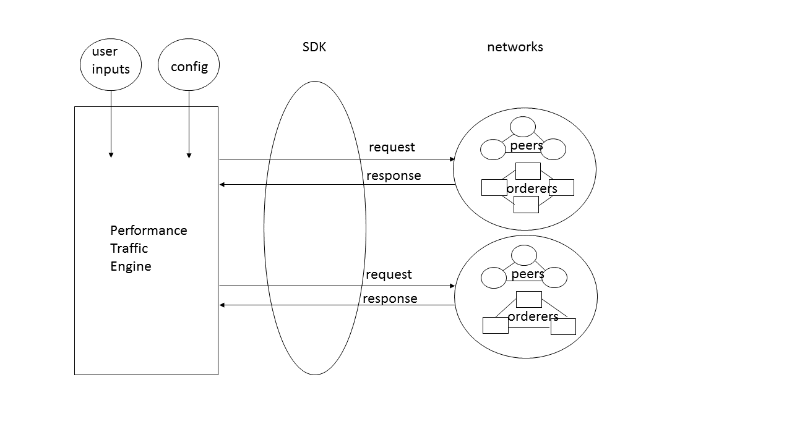
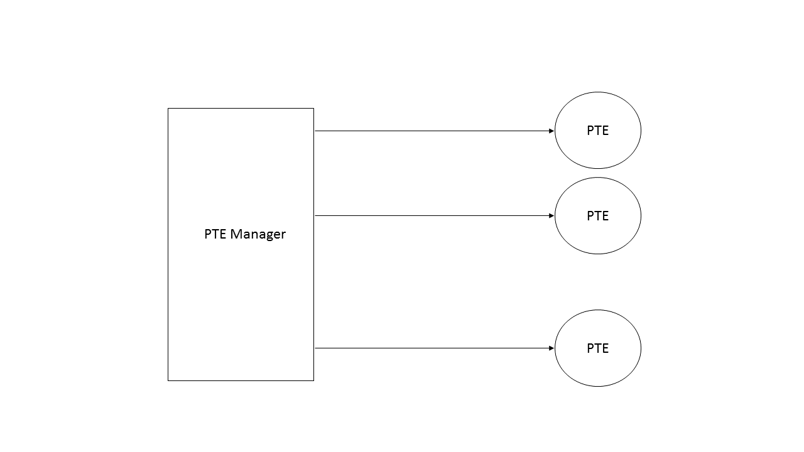

# Performance Traffic Engine - PTE

The Performance Traffic Engine (PTE) uses SDKs to interact with [Hyperledger Fabric](http://hyperledger-fabric.readthedocs.io/en/latest/) networks by sending requests to and receiving responses from one or more networks.   Currently, PTE only uses [Hyperledger Fabric Client (HFC) Node SDK](https://fabric-sdk-node.github.io/index.html) and will include other SDKs in the future.

PTE is designed to meet two-fold requirements:

1. to handle the complexity of the Hyperledger Fabric network, e.g., locations and number of network, number of channels, organizations, peers, orderers etc.
2. to support various test cases, e.g., various chaincodes, transaction number, duration, mode, type, and payload size etc,

In order to meet the two-fold requirements above, flexibility and modularity are the primary design concepts of PTE regarding implementation and usage.  Moreover, PTE provides users many options for their test cases, see below for available options. The design of PTE is demonstrated in the diagram below:

In brief, PTE has the following features:

- channel: to create and join channel
- chaincode: to install and instantiate user specified chaincode
- transactions: to deliver transactions to the targeted peers with specified transaction mode, type, and frequency
- network: to interact with local and/or remote networks simultaneously
- scaling: easy to work with any number of networks, orderers, peers, organizations, channels, chaincodes etc.
- events: to open and listen to event port and maintain the record of events received and un-received
- blockchain height: to query blockchain height and number of transactions
- results: to provide number of transactions sent versus the events received, and validates blockchain contents after last transaction
- multiple PTEs: easy to manage multiple PTEs, see the diagram below:

## Table Of Contents:
- [Prerequisites](#prerequisites)
- [Setup](#setup)
- [Running PTE](#running-pte)
     - [Usage](#usage)
     - [Transaction Execution](#transaction-execution)
     - [Transaction Type](#transaction-type)
     - [Sample Use Cases](#sample-use-cases)
     - [Chaincodes](#chaincodes)
     - [Output](#output)
 - [Reference](#reference)
    - [User Input File](#user-input-file)
    - [Service Credentials File](#service-credentials-file)
    - [Creating a Local Fabric Network](#creating-a-local-fabric-network)
    - [CI Test](#ci-test)

---
### Code Base for v1.0.0
- Fabric commit level: e4b47043270f2293daabf7d24984dd46901e04e7
- fabric-sdk-node commit level: 974bafcb1059c4cb8dda54a9e9d0afc6d87854c5
- fabric-ca commit level: 74f8f4d4c29e45a79a8849efb057dbd8de3ae8d0
- PTE commit level: 359dbfb39f507a737ad52129ac0e4fac9cc03c0b

### Future items

- Endorsement policy is not supported yet.
- Replace fabric-sdk-node with fabric-client and fabric-ca-client.

## Prerequisites
To build and test the following prerequisites must be installed first:

- node and npm lts/boron release (v6.10.x and v3.10.x)
    -  node v7 is not currently supported
- gulp command
    - `npm install -g gulp`
- go (v1.7 or later)
    - refer to [Go - Getting Started](https://golang.org/doc/install)
- others:
    - in Ubuntu: `apt install -y build-essential python libltdl-dev`
    - or refer to your distribution's repository

If planning to run your Fabric network locally, you'll need docker and a bit more. See [Hyperledger Fabric - Getting Started](http://hyperledger-fabric.readthedocs.io/en/latest/getting_started.html) for details.
`
## Setup
1. Download fabric-test sources:
    - `go get -d github.com/hyperledger/fabric-test`

2. Download or update fabric, fabric-ca, and fabric-sdk-node sources, see [Hyperledger fabric-test](https://github.com/hyperledger/fabric-test) for details:
    - `cd $GOPATH/src/github.com/hyperledger/fabric-test`
    - if first time:
         - `git submodule update --init --recursive`
         - `git submodule foreach git pull origin master`
    - else:
         - `git submodule foreach git pull origin master`

3. Obtain appropriate docker images:

    Optionally, you may choose to skip this step of obtaining `fabric` and `fabric-ca` images if plan to run PTE against a remote Fabric network. See [Creating a local Fabric network](#creating-a-local-fabric-network) for additional information on this.

    - fabric
        - download from dockerhub:
            * `cd $GOPATH/src/github.com/hyperledger/fabric-test/fabric/scripts`
            * If testing v1.0.0: `./bootstrap-1.0.0.sh`
        - build images yourself (v1.0.0 shown here):
            * `cd $GOPATH/src/github.com/hyperledger/fabric-test/fabric/`
            * `git checkout v1.0.0`
            * `make docker`
    - fabric-ca
        * `cd $GOPATH/src/github.com/hyperledger/fabric-test/fabric-ca`
        * `git checkout v1.0.0`
        * `make docker`
    - fabric-sdk-node
        * `cd $GOPATH/src/github.com/hyperledger/fabric-test/fabric-sdk-node`
        * If testing v1.0.0: `git checkout v1.0.0`
        * `npm install`
            *  you should be able to safely ignore any warnings
        *  `gulp ca`
        *  `npm install singly-linked-list --save`

4. Install PTE:
    - `cd $GOPATH/src/github.com/hyperledger/fabric-test/tools`
    - `cp -r PTE $GOPATH/src/github.com/hyperledger/fabric-test/fabric-sdk-node/test`

5. Create Service Credentials file(s) for your Fabric network:
    - See the examples in `SCFiles` and change the address to your own Fabric addresses and credentials. Add a block for each organization and peer, ensuring correctness.

6. Specify run scenarios:
    - Create your own version of PTEMgr.txt (if use pte_mgr.sh), runCases.txt and User Input json files, according to the test requirements. Use the desired chaincode name, channel name, organizations, etc. Using the information in your own network profiles, remember to "create" all channels, "join" channel, and "install"  and "instantiate" chaincode for each org, to ensure all peers are set up correctly. Additional information can be found below.

## Running PTE

Before attempting to run PTE ensure your network is running!
If you do not have access to a Fabric network, please see the section on [Creating a local Fabric network](#creating-a-local-fabric-network).

### Usage
There are two ways to execute PTE: pte_mgr.sh and pte_driver.sh. pte_mgr.sh can be used to manage multiple PTEs while pte_driver.sh can only manage one PTE.

* ### pte_mgr.sh

      `./pte_mgr.sh <PTE mgr input file>`

    * Example

        `./pte_mgr.sh sampleccInputs/PTEMgr.txt`

        `sampleccInputs/PTEMgr.txt` contains the list of user specified run cases to be executed.  Each line is a PTE run case and includes two parameters: **driver type** and **run case file**.

        For instance, a PTE mgr file containing two run cases files would be:

            driver=pte sampleccInputs/runCases-constant-i-TLS.txt
            driver=pte sampleccInputs/runCases-constant-q-TLS.txt

        **Note:** Available driver type is pte only.

* ### pte_driver.sh

    `./pte_driver.sh <run cases file>`

    * Example

        `./pte_driver.sh sampleccInputs/runCases.txt`

        `sampleccInputs/runCases.txt` contains the list of test cases to be executed. Each line is a test case and includes two parameters: **SDK type** and **user input file**.

        For instance, a run cases file containing three test cases using the node SDK would be:

            sdk=node sampleccInputs/samplecc-chan1-i-TLS.json
            sdk=node sampleccInputs/samplecc-chan2-i-TLS.json
            sdk=node sampleccInputs/samplecc-chan3-i-TLS.json

        **Note:** Available SDK types are node, go, python and java; however, only the node SDK is currently supported.

    See [User Input file](#user-input-file) in the Reference section below for more information about these files.

### Transaction Execution
A single test case is described by a user input file. User input files define all the parameters for executing a test; including transaction type, number of processes, number of transactions, duration, etc. All processes in one test case will concurrently execute the specified transaction. Different transactions may be used in different test cases and then combined into a single run cases file, making it possible to create more complicated scenarios. For example, in a single run of PTE, a user could send a specific number of invokes to all peers and then query each peer separately.

* ### Transaction Execution Control

    The transaction can be executed with either **transaction number** or **run time duration**.  They are controlled by two user input parameters **nRequest** and **runDur**. See [User Input file](#user-input-file) in the Reference section below on how to control transaction execution using these two parameters.

### Transaction Type
* ### Invoke (move)
    To execute invoke (move) transactions, set the transType to Invoke and invokeType to Move, and specify the network parameters and desired execution parameters:

        "invokeCheck": "TRUE",
        "transMode": "Constant",
        "transType": "Invoke",
        "invokeType": "Move",
        "targetPeers": "OrgAnchor",
        "nProcPerOrg": "4",
        "nRequest": "1000",
        "runDur": "600",
        "TLS": "Enabled",

    And set the channel name in channelOpt:

        "channelOpt": {
            "name": "testchannel1",
            "channelTX": "/root/gopath/src/github.com/hyperledger/fabric-test/fabric/common/tools/cryptogen/crypto-config/ordererOrganizations/testorgschannel1.tx",
            "action":  "create",
            "orgName": [
                "testOrg1"
            ]
        },

* ### Invoke (query)
    To execute invoke (move) transactions, set the transType to Invoke and invokeType to Query, and specify the network parameters and desired execution parameters:

        "invokeCheck": "TRUE",
        "transMode": "Constant",
        "transType": "Invoke",
        "invokeType": "Query",
        "targetPeers": "OrgAnchor",
        "nProcPerOrg": "4",
        "nRequest": "1000",
        "runDur": "600",
        "TLS": "Enabled",

    And set the channel name in channelOpt:

        "channelOpt": {
            "name": "testchannel1",
            "channelTX": "/root/gopath/src/github.com/hyperledger/fabric-test/fabric/common/tools/cryptogen/crypto-config/ordererOrganizations/testorgschannel1.tx",
            "action":  "create",
            "orgName": [
                "testOrg1"
            ]
        },

### Sample Use Cases
* ### Latency
    Example: `sampleccInputs/samplecc-latency-i.json`
    Performs 1000 invokes (Move) with 1 process on 1 network using the sample_cc chaincode. The average of the execution result (execution time (ms)/1000 transactions) represents the latency of 1 invoke (Move).
* ### Long run
    Example: `sampleccInputs/samplecc-longrun-i.json`
    Performs invokes (Move) of various payload size ranging from 1kb-2kb with 1 processes on one network using sample_cc chaincode for 72 hours at 1 transaction per second.
* ### Concurrency
    Example: `sampleccInputs/samplecc-concurrency-i.json`
    Performs invokes (Move) of 1kb payload with 50 processes on one 4-peer network using sample_cc chaincode for 10 minutes.
* ### Complex
    Example: `sampleccInputs/samplecc-complex-i.json`
    Performs invokes (Move) of various payload size ranging from 10kb-500kb with 10 processes on one 4-peer network using sample_cc chaincode for 10 minutes. Each invoke (Move) is followed by an invoke (Query).
* ### More complicated scenarios
    * For multiple chaincodes deployments and transactions, configure each user input file to install and instantiate chaincodes and drive the transactions appropriately.
    * For a stress test on a single network, set all SCFiles to same network. Then concurrent execution of the test is performed against the network but with the workload specified in each user input file.
    * For a density test, configure config json in SCFiles, create run cases files, and user input files for each network. Then execute pte_mgr.sh against these  run cases files.

## Additional Use Cases
Although PTE's primary use case is to drive transactions into a Fabric network, it can be used for creating and joining channels, and chaincode installation and instantiation. This gives the ability for more complete end-to-end scenarios.

* ### Channel Operations
    For any channel activities (create or join), set transType to `Channel`:

        "transMode": "Constant",
        "transType": "Channel",
        "invokeType": "Move",

    * ### Create a channel
        To create a channel, set the action in channelOpt to `create`, and set the name to the channel name. Note that orgName is ignored in this operation:

            "channelOpt": {
                "name": "testchannel1",
                "channelTX": "/root/gopath/src/github.com/hyperledger/fabric-test/fabric/common/tools/cryptogen/crypto-config/ordererOrganizations/testorgschannel1.tx",
                "action":  "create",
                "orgName": [
                    "testOrg1"
                ]
            },

    * ### Join a channel
        To join all peers in an org to a channel, set the action in channelOpt to `join`, set name to channel name, and set orgName to the list of orgs to join:

            "channelOpt": {
                "name": "testchannel1",
                "channelTX": "/root/gopath/src/github.com/hyperledger/fabric-test/fabric/common/tools/cryptogen/crypto-config/ordererOrganizations/testorgschannel1.tx",
                "action":  "join",
                "orgName": [
                    "testOrg1"
                ]
            },

* ### Chaincode Operations
    For chaincode setup (install or instantiate) set `deploy` according to the test. For example:

        "deploy": {
            "chaincodePath": "github.com/hyperledger/fabric-test/fabric-sdk-node/test/fixtures/src/github.com/sample_cc",
            "fcn": "init",
            "args": []
        },

    * ### Install a chaincode
        To install a chaincode, set the transType to `install`:

            "transMode": "Constant",
            "transType": "install",
            "invokeType": "Move",

        And set channelOpt name to the channel name and orgName to a list of org names:

            "channelOpt":
                "name":  "testchannel1",
                "channelTX": "/root/gopath/src/github.com/hyperledger/fabric-test/fabric/common/tools/cryptogen/crypto-config/ordererOrganizations/testorgschannel1.tx",
                "action":  "create",
                "orgName": [
                    "testOrg1"
                ]
            },

        Note that action is ignored.
    * ### Instantiate a chaincode
        To instantiate a chaincode, set the transType to `instantiate`:

            "transMode": "Constant",
            "transType": "instantiate",
            "invokeType": "Move",

        and set channelOpt name to the channel name and specify the list of organizations that the chaincode will be instantiated:

            "channelOpt": {
                "name":  "testchannel1",
                "channelTX": "/root/gopath/src/github.com/hyperledger/fabric-test/fabric/common/tools/cryptogen/crypto-config/ordererOrganizations/testorgschannel1.tx",
                "action":  "create",
                "orgName": [
                    "testOrg1",
                    "testOrg2"
                ]
            },

        Note that action is ignored. PTE instantiates chaincode on all peers of each organization listed in channelOpt.orgName.

        **Recommendation: instantiate a chaincode on the organization before sending a transaction to any peer of that organization.**

* ### Query Blockchain Height Operations
    For any query blockchain height activities (query block), set transType to `QueryBlock`:

        "transMode": "Constant",
        "transType": "QueryBlock",
        "invokeType": "Move",

    * ### Query Blockchain height
        To query the length (number of transactions) in blocks, set org, peer, startBlock, and endBlock in queryBlockOpt:

            "queryBlockOpt": {
                "org":  "org1",
                "peer":  "peer1",
                "startBlock":  "195",
                "endBlock":  "200"
            },

        The following is the output with startBlock=195 and endBlock=200. The output includes the block height and the number of transactions from startBlock to endBlock.

            info: [PTE 0 main]: [queryBlockchainInfo] Channel queryInfo() returned block height=202
            info: [PTE 0 main]: [queryBlockchainInfo] block:Length:accu length= 195:10:10
            info: [PTE 0 main]: [queryBlockchainInfo] block:Length:accu length= 196:10:20
            info: [PTE 0 main]: [queryBlockchainInfo] block:Length:accu length= 197:10:30
            info: [PTE 0 main]: [queryBlockchainInfo] block:Length:accu length= 198:10:40
            info: [PTE 0 main]: [queryBlockchainInfo] block:Length:accu length= 199:10:50
            info: [PTE 0 main]: [queryBlockchainInfo] block:Length:accu length= 200:10:60
            info: [PTE 0 main]: [queryBlockchainInfo] blocks= 195:200, totalLength= 60

## Chaincodes
The following chaincodes are tested and supported:

* **example02**: This is a simple chaincode with limited capability.  This chaincode is **NOT** suitable for performance benchmark.

* **sample_cc**: This chaincode supports variable (randomized) payload sizes and performs encryption and decryption on the payload. Specify ccType as ccchecker when using this chaincode. See directory `sampleccInputs` for examples related to this chaincode. This chaincode is available in `$GOPATH/src/github.com/hyperledger/fabric-test/chaincodes/samplecc/go`.  Set the deploy.chaincodePath to this directory in the user input file.

        "deploy": {
            "chaincodePath": "github.com/hyperledger/fabric-test/chaincodes/samplecc/go",
            "fcn": "init",
            "args": []
        },

* **marbles_cc**: [Marbles chaincode](https://github.com/hyperledger/fabric/tree/master/examples/chaincode/go/marbles02). PTE alters the marble name (the first argument) and the marble size (the third argument) for each `initMarble` transaction. Specify ccType as marblescc when using this chaincode.  See directory `marblesccInputs` for examples related to this chaincode. This chaincode is available in `$GOPATH/src/github.com/hyperledger/fabric-test/fabric/examples/chaincode/go/marbles02`.  Set the deploy.chaincodePath to this directory in the user input file.

        "deploy": {
            "chaincodePath": "github.com/hyperledger/fabric-test/fabric/examples/chaincode/go/marbles02",
            "fcn": "init",
            "args": []
        },

## Output
The output includes network id, process id, transaction type, total transactions, completed transactions, failed transactions, starting time, ending time, and elapsed time.
* For example, consider a test case that has 4 processes driving a single peer. The output shows that network 0 process 0 executed 1000 moves with no failure in 406530 ms, network 0 process 1 executed 1000 moves with no failure in 400421 ms, and so on.  Note that the starting and ending timestamps are provided:

    stdout: [Nid:id=0:3] eventRegister: completed 1000(1000) Invoke(Move) in 259473 ms, timestamp: start 1492024894518 end 1492025153991
    stdout: [Nid:id=0:2] eventRegister: completed 1000(1000) Invoke(Move) in 364174 ms, timestamp: start 1492024894499 end 1492025258673
    stdout: [Nid:id=0:1] eventRegister: completed 1000(1000) Invoke(Move) in 400421 ms, timestamp: start 1492024894500 end 1492025294921
    stdout: [Nid:id=0:0] eventRegister: completed 1000(1000) Invoke(Move) in 406530 ms, timestamp: start 1492024894498 end 1492025301028

## Reference

### User Input file

    {
        "channelID": "_ch1",
        "chaincodeID": "sample_cc",
        "chaincodeVer": "v0",
        "logLevel": "ERROR",
        "invokeCheck": "TRUE",
        "transMode": "Constant",
        "transType": "Invoke",
        "invokeType": "Move",
        "targetPeers": "OrgAnchor",
        "nProcPerOrg": "4",
        "nRequest": "0",
        "runDur": "600",
        "TLS": "enabled",
        "queryBlockOpt": {
            "org":  "org1",
            "peer":  "peer1",
            "startBlock":  "6590",
            "endBlock":  "6800"
        },
        "channelOpt": {
            "name": "testchannel1",
            "channelTX": "/root/gopath/src/github.com/hyperledger/fabric-test/fabric/common/tools/cryptogen/crypto-config/ordererOrganizations/testorgschannel1.tx",
            "action":  "create",
            "orgName": [
                "org1"
            ]
        },
        "burstOpt": {
            "burstFreq0":  "500",
            "burstDur0":  "3000",
            "burstFreq1": "2000",
            "burstDur1": "10000"
        },
        "mixOpt": {
            "mixFreq": "2000"
        },
        "constantOpt": {
            "recHIST": "HIST",
            "constFreq": "1000",
            "devFreq": "300"
        },
        "listOpt": {
            "org1": ["peer1"],
            "org2": ["peer1"]
        },
        "eventOpt": {
            "listener": "Transaction",
            "timeout": "240000"
        },
        "ccType": "general",
        "ccOpt": {
            "keyStart": "5000",
            "payLoadMin": "1024",
            "payLoadMax": "2048"
        },
        "deploy": {
            "chaincodePath": "github.com/hyperledger/fabric-test/fabric-sdk-node/test/fixtures/src/github.com/sample_cc",
            "fcn": "init",
            "args": []
        },
        "invoke": {
            "query": {
                "fcn": "invoke",
                "args": ["get", "a"]
            },
            "move": {
                "fcn": "invoke",
                "args": ["put", "a", "string-msg"]
            }
        },
        "SCFile": [
            {"ServiceCredentials":"SCFiles/config-chan1-TLS.json"}
        ]
    }

where:

* **channelID**: channel ID for the run.
* **chaincodeID**: chaincode ID for the run.
* **chaincodeVer**: chaincode version.
* **logLevel**: logging level for the run. Options are ERROR, DEBUG, or INFO.  Set to ERROR for performance test. The default value is ERROR.
* **invokeCheck**: if this is TRUE, then a query will be executed for the last invoke upon the receiving of the event of the last invoke. This value is ignored for query test.
* **transMode**: transaction mode
    * **Simple**: one transaction type and rate only, the subsequent transaction is sent when the response of sending transaction (not the event handler), success or failure, of the previous transaction is received
    * **Burst**: various traffic rates, see burstOpt for detailed
    * **Mix**: mix invoke and query transactions, see mixOpt for detailed
    * **Constant**: the transactions are sent by the specified rate, see constantOpt for detailed
    * **Latency**: one transaction type and rate only, the subsequent transaction is sent when the event message (ledger update is completed) of the previous transaction is received
* **transType**: transaction type
    * **Channel**: channel activities specified in channelOpt.action
    * **Install**: install chaincode
    * **Instantiate**: instantiate chaincode
    * **QueryBlock**: query blockchain information
    * **Invoke**: invokes transaction
* **invokeType**: invoke transaction type. This parameter is valid only if the transType is set to invoke
    * **Move**: move transaction
    * **Query**: query transaction
* **targetPeers**: the target peers that transactions will sent to
    * **OrgAnchor**: send to the anchor peer (peer1) of the organization being executed in the current process
    * **AllAnchors**: send to the anchor peers of all organizations
    * **OrgPeers**: send to all peers in the organization being executed in the current process
    * **AllPeers**: send to all peers in all organizations
    * **List**: only send to the peers given in listOpt, see listOpt below for details
* **nProcPerOrg**: number of processes for the test
* **nRequest**: number of transactions to be executed for each process
* **runDur**: run duration in seconds to be executed  for each process.
    * if nRequest is non-zero the nRequest is executed.
    * if nRequest is zero and runDur is non-zero, then runDur is executed.
    * if both nRequest and runDur are zero, then PTE runs forever.
* **TLS**: TLS setting for the test: Disabled or Enabled.
* **queryBlock**: query blockchain information options
    * **org**: the org to be queried
    * **peer**: the peer to be queried
    * **startBlock**: the starting block
    * **endBlock**: the ending block. If the the ending block is greater than the chain height in the peer, eBlock will be set to the chain height.
* **channelOpt**: transType channel options
    * **name**: channel name
    * **channelTX**: channel transaction file
    * **action**: channel action: create or join
    * **orgName**: name of organization for the test
* **burstOpt**: the frequencies and duration for Burst transaction mode traffic. Currently, two transaction rates are supported. The traffic will issue one transaction every burstFreq0 ms for burstDur0 ms, then one transaction every burstFreq1 ms for burstDur1 ms, then the pattern repeats. These parameters are valid only if the transMode is set to **Burst**.
    * **burstFreq0**: frequency in ms for the first transaction rate
    * **burstDur0**:  duration in ms for the first transaction rate
    * **burstFreq1**: frequency in ms for the second transaction rate
    * **burstDur1**: duration in ms for the second transaction rate
* **mixOpt**: each invoke is followed by a query on every process. This parameter is valid only the transMode is set to **Mix**.
* **mixFreq**: frequency in ms for the transaction rate. This value should be set based on the characteristics of the chaincode to avoid the failure of the immediate query.
* **constantOpt**: the transactions are sent at the specified rate. This parameter is valid only the transMode is set to **Constant**.
    * **recHist**: This parameter indicates if brief history of the run will be saved.  If this parameter is set to HIST, then the output is saved into a file, namely ConstantResults.txt, under the current working directory.  Otherwise, no history is saved.
    * **constFreq**: frequency in ms for the transaction rate.
    * **devFreq**: deviation of frequency in ms for the transaction rate. A random frequency is calculated between `constFrq-devFreq` and `constFrq+devFreq` for the next transaction.  The value is set to default value, 0, if this value is not set in the user input json file.  All transactions are sent at constant rate if this number is set to 0.
* **listOpt**: targetPeers list of the peers that the transactions are sent. These parameters are valid only when the targetPeers is set to List. Each line includes two parameters: **org name** and **peer array within the org**, for example:

             "listOpt": {
                 "org1": ["peer1","peer2"],
                 "org3": ["peer1"],
                 "org6": ["peer3"]
             }

* **eventOpt**: event hub options
    * **listener**: event listener
        * **Transaction**: PTE registers a transaction listener to receive a registered transaction event. This is the default event listener.
        * **Block**: PTE registers a block listener to receive every block event on all channels. PTE will parse the received block event for the transactions sent. The block listener option applies to tranMode CONSTANT only.
        * **None**: PTE will not register any event listener.
    * **timeout**: event timeout, applied to the transaction listener only, unit ms
* **ccType**: chaincode type
    * **ccchecker**: The first argument (key) in the query and invoke request is incremented by 1 for every transaction.  The prefix of the key is made of process ID, ex, all keys issued from process 4 will have prefix of **key3_**. And, the second argument (payload) in an invoke (Move) is a random string of size ranging between payLoadMin and payLoadMax defined in ccOpt.
    * **general**: The arguments of transaction request are taken from the user input json file without any changes.
* **ccOpt**: chaincode options
    * **keyStart**: the starting transaction key index, this is used when the ccType is non general which requires a unique key for each invoke.
    * **payLoadMin**: minimum size in bytes of the payload. The payload is made of random string with various size between payLoadMin and payLoadMax.
    * **payLoadMax**: maximum size in bytes of the payload
* **deploy**: deploy transaction contents
* **invoke** invoke transaction contents
    * **query**: query content
    * **move**: move content
* **SCFile**: the service credentials json.

## Service Credentials file
The service credentials contain the information of the network and are stored in the `SCFiles` directory. The following is a sample of the service credentials json file:

    {
        "test-network": {
            "orderer": {
                    "name": "OrdererMSP",
                    "mspid": "OrdererMSP",
                    "mspPath": "./crypto-config",
                    "adminPath": "./crypto-config/ordererOrganizations/example.com/users/Admin@example.com/msp",
                    "comName": "example.com",
                    "url": "grpcs://localhost:5005",
                    "server-hostname": "orderer0.example.com",
                    "tls_cacerts": "./crypto-config/ordererOrganizations/example.com/orderers/orderer0.example.com/msp/cacerts/ca.example.com-cert.pem"
            },
            "org1": {
                    "name": "Org1MSP",
                    "mspid": "Org1MSP",
                    "mspPath": "./crypto-config",
                    "adminPath": "./crypto-config/peerOrganizations/org1.example.com/users/Admin@org1.example.com/msp",
                    "comName": "example.com",
                    "ca": {
                         "url":"https://localhost:7054",
                         "name": "ca-org1"
                    },
                    "username": "admin",
                    "secret": "adminpw",
                    "peer1": {
                            "requests": "grpc://localhost:7061",
                            "events": "grpc://localhost:7051",
                            "server-hostname": "peer0.org1.example.com",
                            "tls_cacerts": "../fixtures/tls/peers/peer0/ca-cert.pem"
                    },
                    "peer2": {
                            "requests": "grpc://localhost:7062",
                            "events": "grpc://localhost:7052",
                            "server-hostname": "peer1.org1.example.com",
                            "tls_cacerts": "../fixtures/tls/peers/peer0/ca-cert.pem"
                    }
            },
            "org2": {
                    "name": "Org2MSP",
                    "mspid": "Org2MSP",
                    "mspPath": "./crypto-config",
                    "adminPath": "./crypto-config/peerOrganizations/org2.example.com/users/Admin@org2.example.com/msp",
                    "comName": "example.com",
                    "ca": {
                         "url":"https://localhost:8054",
                         "name": "ca-org2"
                    },
                    "username": "admin",
                    "secret": "adminpw",
                    "peer1": {
                            "requests": "grpcs://localhost:7063",
                            "events": "grpcs://localhost:7053",
                            "server-hostname": "peer0.org2.example.com",
                            "tls_cacerts": "./crypto-config/peerOrganizations/org2.example.com/peers/peer0.org2.example.com/msp/cacerts/ca.org2.example.com-cert.pem"
                    },
                    "peer2": {
                            "requests": "grpcs://localhost:7064",
                            "events": "grpcs://localhost:7054",
                            "server-hostname": "peer1.org2.example.com",
                            "tls_cacerts": "./crypto-config/peerOrganizations/org2.example.com/peers/peer1.org2.example.com/msp/cacerts/ca.org2.example.com-cert.pem"
                    }
            }
        }
    }

## Creating a local Fabric network
- If you do not yet have the Fabric docker images in your local docker registry, please either build them from Fabric source or download them from dockerhub.
    - `cd $GOPATH/src/github.com/hyperledger/fabric-test/fabric/examples/e2e_cli/`
    - `sh ./download-dockerimages.sh -c x86_64-1.0.0 -f x86_64-1.0.0`
- If you do not have an existing network already, you can start a network using the Fabric e2e example:
    - `cd $GOPATH/src/github.com/hyperledger/fabric-test/fabric/examples/e2e_cli/`
    - Edit `network_setup.sh` and change **COMPOSE_FILE**:

            COMPOSE_FILE=docker-compose-e2e.yaml

    - `./network_setup.sh up`
- Alternatively, consider using the [NetworkLauncher](https://github.com/hyperledger/fabric-test/tree/master/tools/NL) tool:
    - `cd $GOPATH/src/github.com/hyperledger/`
    - `git clone https://github.com/hyperledger/fabric-test`
    - `cd tools/NL`
    - `./networkLauncher.sh -?`

## CI Test

A set of predefined tests are designed for CI daily or weekly execution and are available in the directory, `CITest`, under PTE.
---

 This work is licensed under a <a rel="license" href="http://creativecommons.org/licenses/by/4.0/">Creative Commons Attribution 4.0 International License</a>.
