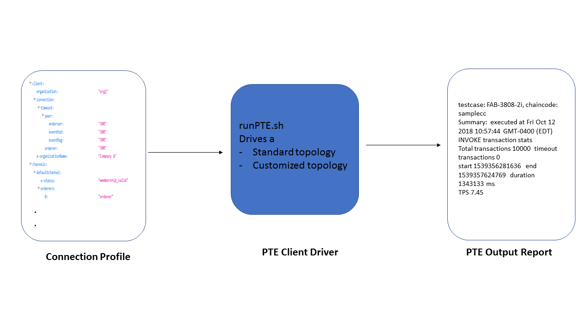

# Hyperledger Fabric Network Testing

## Summary
You have found the home for testing a fabric network in any topology.

We use the [Performance Traffic Engine (PTE)](https://github.com/hyperledger/fabric-test/tree/master/tools/PTE)
as the client driver.
The script `runPTE.sh` invokes the PTE tool to execute user-selected tests.

Users may write their own customized test scripts to run with their own custom network topology; however to allow you to get started quickly, we provide a set of eight predefined test scenarios that can run on a basic default topology (described in the Prerequisites section). See below for more details about the predefined tests.

A valid connection profile is required as input; and your network must be running (with channels created, peers joined, etc) before starting these tests.
The connection profile may be based on the fabric deployment of choice (cloud offering, Cello, K8S or customized deployment).
For reference, a formatted sample connection profile is provided in the default location ./connectionprofile/. (*The sample cannot be used to actually run any tests; the user must supply an actual connection profile of their own network with orgs, peers, appropriate admin certs, etc.*)

## Prerequisites

1. Git-clone fabric-test repository, and go to the networktest directory

    For example, to set up fabric-test in latest master branch (*Note*: when testing with a release branch, replace `master` with the branch name, e.g. `release-1.3`):

        cd $GOPATH/src/github.com/hyperledger
        git clone --single-branch -b master https://github.com/hyperledger/fabric-test.git

        cd fabric-test/tools/networktest

1. Connection Profile

    You need to create a directory to store all your connection profiles for your network.
    Or, you may use the default directory, ./connectionprofile/ and replace the sample files there.
    The fully automated tests assume a specific network topology to be defined in the
    connection profile, and the network should be running already.
    The topology **MUST** include the following items. (Note the predefined testcases use names matching the default channel, orgs, peers, chaincode version, etc, as specified here.  If your network used names other than the default names, then you must remember to use the corresponding options of runPTE.sh, such as --org, to provide the names from your connection profile to use in the test.)

    * one channel; you can specify the channel name or use the default channel name: defaultchannel
    * two organizations in the channel; you can specify the org names or use the default org names: org1 and org2
    * a minimum of 1 peer in each org that has joined the channel
    * network must use TLS enabled

## Introduction to the PTE Network Test Driver
The PTE network test driver is designed to execute tests varying from
health checks and sanity tests to load, stress, and performance tests.
The `runPTE.sh` provides many valuable functions to ensure successful execution such as:

* npm install fabric-client and fabric-ca-client
* convert connection profiles to PTE service credential json
* install and instantiate chaincode
* execute selected PTE testcases

The tests assume the network is set up and peers have joined channels. Each testcase typically generates multiple threads of concurrent traffic, whether invokes (moves) or queries or both. Each thread sends a predefined number of transactions (e.g. 10,000) to a specific peer. When sending invokes, each thread registers and confirms receipt of all events using filteredblock (unless otherwise noted), and then queries the same target peer in the channel to verify that the last transaction sent was written to the ledger successfully.

Upon completion, testers can review the test report summary logs for each PTE test run
at `fabric-test/tools/networktest/Logs/pteReport*.log`

   For help, execute

        ./runPTE.sh -h

        USAGE:   ./runPTE.sh [options] [values]

        -h, --help      view this help message

        --no-npm        skip npm re-install fabric-client packages

        --dir           absolute path or relative path from .../fabric-test/tools/networktest/ to the directory that contains the network connection profile to be converted
                        (Default: ./connectionprofile/)

        --channel <channel name>
                        (Must match channel names in connection profile. Default: defaultchannel)

        --org <list of org names>
                        (Must match org names in connection profile. Default: org1 org2)

        --ccver <chaincode version to instantiate>
                        (Default: v0. Note: cannot be used with --ccupgrade)

        --ccname <chaincode name>
                        (Default: the name defined in each testcase.)

        --ccupgrade     <chaincode version to upgrade>
                        (Note: cannot be used with --ccver)

        --txtarget      <OrgAnchor|AllAnchors|OrgPeers|AllPeers>
                        (Default: OrgAnchor)

        -t, --testcase <list of testcases>

        -s, --sanity    execute a sanity test of 2 predefined testcases: FAB-3808-2i FAB-3811-2q (~30 min)

        -a, --all       execute all predefined testcases (~3.5 hrs)

Note: see [Performance Traffic Engine (PTE)](https://github.com/hyperledger/fabric-test/blob/master/tools/PTE)
for txtarget option.

### Examples:

        ./runPTE.sh --dir connectionprofile -t FAB-3808-2i FAB-3811-2q
        ./runPTE.sh -s
        ./runPTE.sh -a

### Available predefined testcases:

For an overview of all testcases refer to [CITest](https://github.com/hyperledger/fabric-test/tree/master/tools/PTE/CITest). To find more details to understand a particular testcase, for example FAB-3808, refer to jira for the [description](https://jira.hyperledger.org/browse/FAB-3808). We welcome any new testcase contributions.

    FAB-3808-2i: sanity, 2 threads X 10000 invokes, samplecc
    FAB-3811-2q: sanity, 2 threads X 10000 queries, samplecc (must follow FAB-3808-2i)
    FAB-3807-4i: 4 threads X 10000 invokes, samplecc
    FAB-3835-4q: 4 threads X 10000 queries, samplecc (must follow FAB-3807-4i)
    FAB-4038-2i: 2 threads X 10000 invokes, samplejs
    FAB-4036-2q: 2 threads X 10000 queries, samplejs (must follow FAB-4038-2i)
    FAB-7329-4i: 4 threads X 10000 invokes, samplejs, full block event
    FAB-7333-4i: 4 threads X 10000 invokes, samplejs, filtered block event (default)

### Notes:

* All the listed testcases require only one channel and 2 orgs.
Use options --channel and --org only if your connection profile uses something other than defaultchannel and org1 and org2.
To run additional predefined testcases, or custom testcases, that are not listed here, use care to join peers to all the correct channels as used by the testcases.

* The tool installs/instantiates chaincode every time, so you may ignore these errors if the chaincode is already installed/instantiated:

        error: [client-utils.js]: sendPeersProposal - Promise is rejected: Error: 2 UNKNOWN: chaincode error (status: 500, message: Error installing chaincode code ... chaincodes/sample_cc_ch1.v0 exists))

        error: [client-utils.js]: sendPeersProposal - Promise is rejected: Error: 2 UNKNOWN: chaincode error (status: 500, message: chaincode exists sample_cc_ch1)

